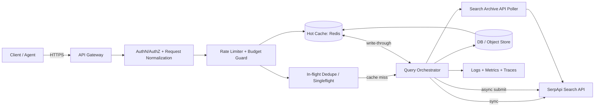
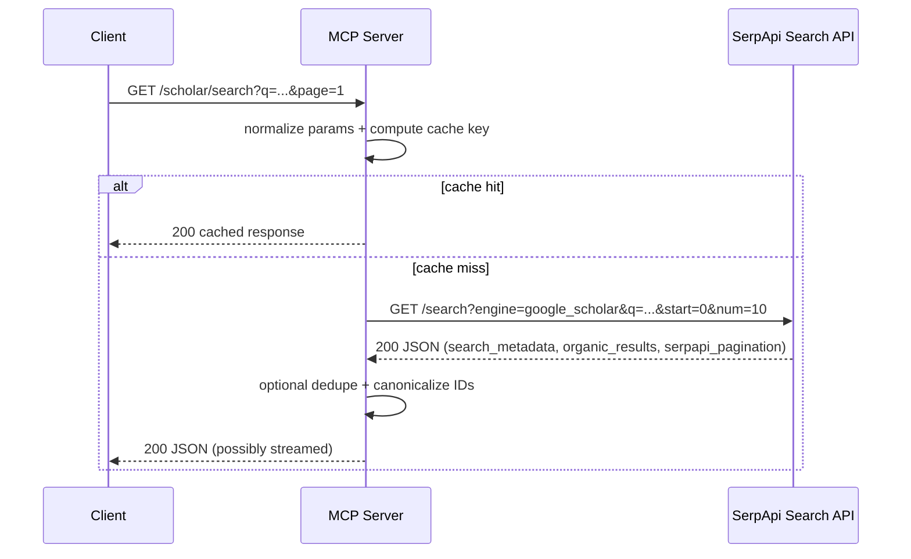
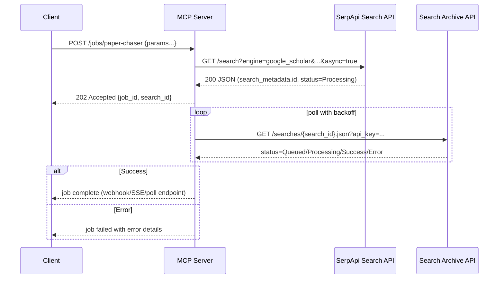

# SerpApi Google Scholar Functionality Deep Research for Building an MCP Server

## Executive summary

SerpApi exposes Google Scholar data primarily through the **Search API** endpoint (`/search`) with multiple Scholar-specific “engines,” most importantly **`google_scholar`** (article/case-law search + “Cited by” + “All versions”), **`google_scholar_author`** (author profile + publication list + citation graph + co-authors), and **`google_scholar_cite`** (citation export formats like BibTeX). citeturn4view0turn21view1turn21view2turn16view1

For MCP-server design, the key architectural realities are: (a) **usage is billed per successful request** (not per number of results), including pagination requests, (b) SerpApi provides a **1-hour cache** for identical requests (free, not counted) unless `no_cache=true`, and (c) throughput is governed by a published **hourly throughput limit** (e.g., 20% of monthly quota per hour for standard plans), with `429` like “Too Many Requests” indicating either **throughput-limit exhaustion or no searches remaining**. citeturn4view0turn10search0turn10search1turn12view0turn11view3

Operationally, SerpApi supports both synchronous and asynchronous workflows. `async=true` submits a job and requires polling the **Search Archive API** for completion; archive retention is **up to 31 days after completion**, after which a `410 Gone` can occur. citeturn11view0turn12view0turn4view0

From a compliance and risk standpoint, Google’s current Terms prohibit **using automated means to access content in violation of machine-readable instructions (robots.txt)**, and Google Scholar’s `robots.txt` explicitly disallows key Scholar paths (e.g., `/scholar`, `/search`). This creates a non-trivial policy/legal risk surface for any system built for scale—regardless of whether you use an intermediary. citeturn9view1turn27view0

The remainder of this report inventories the engines/parameters/schemas and then translates those behaviors into concrete design patterns for a high-quality, production MCP (metadata collection/proxy) server: strict request normalization, caching and in-flight de-duplication, adaptive throttling using Account API metrics, resilient retry/backoff for SerpApi `5xx`, support for two-phase citation expansion flows, and strong security boundaries around upstream API keys. citeturn13view0turn12view0turn26view0turn25view0

## Repo note

The shipped MCP surface in this repository now exposes these explicit
SerpApi-backed workflows:

- `search_papers_serpapi`
- `search_papers_serpapi_cited_by`
- `search_papers_serpapi_versions`
- `get_author_profile_serpapi`
- `get_author_articles_serpapi`
- `get_paper_citation_formats`
- `get_serpapi_account_status`

SerpApi still remains guarded operationally:

- it is disabled by default
- it is not part of silent broad fanout
- it is intended for explicit recall recovery, citation discovery, author
  workflows, and quota-aware deep research rather than the default broker path

Search Archive polling and broader async archive orchestration are still best
treated as advanced or future-facing extensions rather than the default
interactive flow.

## Google Scholar engines and API inventory

### Overview of relevant SerpApi endpoints

All major Scholar functionality is driven by the SerpApi Search endpoint:

- `GET https://serpapi.com/search?engine=<engine_name>&...` (or `.json` variants as shown in SerpApi-provided links embedded in responses). citeturn4view0turn31view1turn21view2

Supporting endpoints you will almost certainly want in an MCP server:

- **Search Archive API**: `GET https://serpapi.com/searches/{search_id}` with `output=json|html` to retrieve the result of a prior async (or sync) search; retrievable up to **31 days** after completion. citeturn11view0
- **Account API**: `GET https://serpapi.com/account.json?api_key=...` to fetch remaining monthly quota and *hourly throughput limit*, free of charge and not counted toward quota. citeturn13view0
- **Status and Error Codes** documentation defines HTTP codes and the standard error shape for Search APIs. citeturn12view0turn11view1

### Engine inventory

#### Engine `google_scholar`

**Purpose and features**  
The `google_scholar` engine provides Google Scholar search results and supports:
- Standard keyword queries (`q`) with helpers such as `author:` and `source:`. citeturn4view0
- “Cited by” expansion via `cites=<cites_id>`. citeturn4view0turn18view1
- “All versions” expansion via `cluster=<cluster_id>`. citeturn4view0turn18view1
- Date bounds filtering (`as_ylo`, `as_yhi`). citeturn4view0
- Sorting articles “added in the last year” via `scisbd` (date-sorted mode vs relevance). citeturn4view0
- Article vs case law selection and patent inclusion/exclusion behavior via `as_sdt` (notably: patents excluded by default when used as a filter). citeturn4view0turn31view0
- Adult-content filtering (`safe`), and “Similar/Omitted results” filtering behavior (`filter`). citeturn4view0

**Endpoint**
- `GET https://serpapi.com/search?engine=google_scholar&...` citeturn4view0

**API uptime (as shown on the documentation page)**
- The documentation page exposes an uptime metric for this API (e.g., “API uptime 99.997%”). citeturn3view0

**Parameters (Scholar-specific + core SerpApi parameters)**  
The table below is sourced from the official `google_scholar` API documentation.

| Parameter | Required | Type | Default | Notes |
|---|---:|---|---|---|
| `q` | Required\* | string | — | Main query. Becomes optional if `cites` is used; `cites` + `q` triggers “search within citing articles.” `cluster` cannot be combined with `q` or `cites`. citeturn4view0 |
| `cites` | Optional | string/int-like | — | “Cited by” target article ID; returns citing documents. citeturn4view0 |
| `cluster` | Optional | string/int-like | — | “All versions” target article ID; must be used alone (no `q`/`cites`). citeturn4view0 |
| `as_ylo` | Optional | int (year) | — | Include results from this year forward. citeturn4view0 |
| `as_yhi` | Optional | int (year) | — | Include results up to this year. citeturn4view0 |
| `scisbd` | Optional | int enum | `0` | `0` relevance; `1` only abstracts; `2` include everything; described as “articles added in the last year, sorted by date.” citeturn4view0 |
| `hl` | Optional | string | — | Two-letter UI language. citeturn4view0 |
| `lr` | Optional | string | — | One or more languages like `lang_fr|lang_de`. citeturn4view0 |
| `start` | Optional | int | `0` | Offset for pagination; 10 results per page semantics in docs (`0`, `10`, `20`, …). citeturn4view0turn31view0 |
| `num` | Optional | int | `10` | 1–20 results per page. citeturn4view0 |
| `as_sdt` | Optional | string/int (multi) | varies | As filter: `0` exclude patents (default), `7` include patents. As search type: `4` selects case law (US courts) and can be combined with court IDs as comma-separated list. citeturn4view0turn31view0 |
| `safe` | Optional | string enum | (Google default) | `active` or `off`; docs note Google blurs explicit content by default. citeturn4view0 |
| `filter` | Optional | int enum | `1` | Controls “Similar Results” and “Omitted Results” filters; `1` on (default), `0` off. citeturn4view0 |
| `as_vis` | Optional | int enum | `0` | `1` excludes “citations” results; `0` includes them. citeturn4view0 |
| `as_rr` | Optional | int enum | `0` | `1` review articles only; `0` all. citeturn4view0 |
| `engine` | Required | string | — | Must be `google_scholar`. citeturn4view0 |
| `no_cache` | Optional | boolean | `false` | Forces fresh fetch even if cached; cache served only if **query + all params** match; cache expires after **1h**; cached searches are free/not counted; cannot combine with `async`. citeturn4view0 |
| `async` | Optional | boolean | `false` | If `true`, submit then retrieve later via Search Archive API; cannot combine with `no_cache`; should not be used if Ludicrous Speed is enabled. citeturn4view0turn11view0turn11view2 |
| `zero_trace` | Optional | boolean | `false` | Enterprise-only; skip storing search params/files/metadata. citeturn4view0turn23view0 |
| `api_key` | Required | string | — | SerpApi private key. citeturn4view0 |
| `output` | Optional | `json` or `html` | `json` | `html` returns raw HTML for debugging/coverage gaps. citeturn4view0 |
| `json_restrictor` | Optional | string | — | Restrict response fields for smaller/faster payloads; supported across engines. citeturn4view0turn25view0 |

\*Docs explicitly state that `q` becomes optional when using `cites`. citeturn4view0

**Response schema (documented by examples; fields vary by query type)**  
SerpApi’s Scholar responses follow the common Search API structure: `search_metadata`, `search_parameters`, `search_information`, plus result arrays such as `organic_results`. citeturn4view0turn18view2  
Key additional structures visible in examples include:

- `organic_results[]` with `result_id`, and `inline_links` that include:
  - `cited_by.total` + `cited_by.cites_id` and a `serpapi_scholar_link`
  - `versions.cluster_id` and `serpapi_scholar_link` for version expansion
  - `serpapi_cite_link` pointing to a `google_scholar_cite` query
  - `related_pages_link` and `serpapi_related_pages_link` citeturn18view1turn4view0turn31view2
- `pagination` and `serpapi_pagination` objects, including `next` links. citeturn31view2turn31view1turn31view0
- Some flows may include additional arrays such as `citations_per_year` and a `profiles` block. citeturn31view2

**Sample response (abridged)**  
```json
{
  "search_metadata": {
    "id": "…",
    "status": "Success",
    "json_endpoint": "https://serpapi.com/searches/.../....json",
    "google_scholar_url": "https://scholar.google.com/scholar?&q=biology",
    "raw_html_file": "https://serpapi.com/searches/.../....html",
    "total_time_taken": 1.24
  },
  "search_parameters": { "engine": "google_scholar", "q": "biology" },
  "search_information": {
    "total_results": 5880000,
    "time_taken_displayed": 0.06,
    "query_displayed": "biology"
  },
  "organic_results": [
    {
      "position": 0,
      "title": "Population biology of plants.",
      "result_id": "JC4Acibs_4kJ",
      "link": "https://…",
      "snippet": "…",
      "publication_info": { "summary": "…" },
      "inline_links": {
        "serpapi_cite_link": "https://serpapi.com/search.json?engine=google_scholar_cite&q=JC4Acibs_4kJ&token=…",
        "cited_by": {
          "total": 14003,
          "cites_id": "9943926152122871332",
          "serpapi_scholar_link": "https://serpapi.com/search.json?cites=9943926152122871332&engine=google_scholar&hl=en"
        },
        "versions": {
          "total": 6,
          "cluster_id": "9943926152122871332",
          "serpapi_scholar_link": "https://serpapi.com/search.json?cluster=9943926152122871332&engine=google_scholar&hl=en"
        }
      }
    }
  ]
}
```
citeturn4view0

#### Engine `google_scholar_author`

**Purpose and features**  
The `google_scholar_author` engine scrapes an author profile page and returns:
- Author identity/affiliation/email (as displayed by Scholar)
- Interests and links to profile searches
- Article list with `citation_id`, per-article cited-by counts/links
- Global citation metrics (table + citation graph)
- Public-access statistics and co-authors citeturn21view1turn17view3turn17view2turn17view1

It also supports “sub-views” via `view_op`, including retrieving a single article citation view (covered further under “Author citation”). citeturn21view1turn16view2

**Endpoint**
- `GET https://serpapi.com/search?engine=google_scholar_author&...` citeturn21view1

**API uptime (as shown on the documentation page)**
- The documentation page shows “API uptime 100.000%”. citeturn21view1

**Parameters**

| Parameter | Required | Type | Default | Notes |
|---|---:|---|---|---|
| `author_id` | Required | string | — | Extracted from `https://scholar.google.com/citations?user={author_id}`; docs note it can be found via Scholar Profiles API or directly from the profile URL. citeturn21view1 |
| `hl` | Optional | string | — | UI language. citeturn21view1 |
| `view_op` | Optional | string enum | — | `view_citation` (requires `citation_id`) or `list_colleagues`. citeturn5view2turn16view2 |
| `sort` | Optional | string enum | (citations) | `title` or `pubdate`; default sorting is by number of citations. citeturn5view2turn21view1 |
| `citation_id` | Optional\* | string | — | Required when `view_op=view_citation`. citeturn5view2turn16view2 |
| `start` | Optional | int | `0` | Pagination offset; docs use 20-step pattern (`0`, `20`, `40`, …). citeturn5view2turn21view1 |
| `num` | Optional | int | `20` | Default 20, max 100. citeturn5view2 |
| (Core SerpApi params) | — | — | — | Includes `no_cache`, `async`, `zero_trace`, `api_key`, `output`, `json_restrictor`. citeturn14view0turn25view0 |

\*Conditionally required. citeturn5view2turn16view2

**Response schema highlights (from official examples)**  
- `author` object: `name`, `affiliations`, `email`, `interests[]`, `thumbnail`. citeturn17view0turn17view1
- `articles[]` includes `title`, `link`, `citation_id`, `authors`, `publication`, `year`, and per-article `cited_by` with a link and a SerpApi scholar link. citeturn17view1turn17view2
- `cited_by` includes:
  - `table[]` with totals and “since” values (example shows localized keys like `depuis_2016`)
  - `graph[]` by year citeturn17view2turn17view3
- `public_access` and `co_authors[]` blocks. citeturn17view3

**Sample response (abridged)**  
```json
{
  "search_metadata": {
    "id": "…",
    "status": "Success",
    "google_scholar_author_url": "https://scholar.google.com/citations?user=LSsXyncAAAAJ&hl=en",
    "total_time_taken": 1.26
  },
  "search_parameters": { "engine": "google_scholar_author", "author_id": "LSsXyncAAAAJ", "hl": "en" },
  "author": {
    "name": "Cliff Meyer",
    "affiliations": "…",
    "email": "…",
    "interests": [{ "title": "Computational Biology", "link": "…", "serpapi_link": "…" }],
    "thumbnail": "https://scholar.google.com/citations/images/avatar_scholar_128.png"
  },
  "articles": [
    {
      "title": "Model-based analysis of ChIP-Seq (MACS)",
      "citation_id": "LSsXyncAAAAJ:2osOgNQ5qMEC",
      "cited_by": {
        "value": 9186,
        "link": "https://scholar.google.com/scholar?oi=bibs&hl=fr&cites=14252090027271643524",
        "serpapi_link": "https://serpapi.com/search.json?cites=14252090027271643524&engine=google_scholar&hl=en"
      },
      "year": "2008"
    }
  ],
  "cited_by": {
    "table": [{ "citations": { "all": 21934 } }],
    "graph": [{ "year": 2004, "citations": "59" }]
  },
  "public_access": { "available": 39, "not_available": 0 },
  "co_authors": [{ "name": "Myles Brown", "author_id": "wwxk-JMAAAAJ", "serpapi_link": "…" }]
}
```
citeturn5view1turn17view3turn17view1

#### Engine `google_scholar_author` with `view_op=view_citation` (Author citation extraction)

SerpApi documents “Google Scholar Author Citation API” as a flow implemented through the same endpoint/engine (`google_scholar_author`) by providing:
- `view_op=view_citation`
- `citation_id=<id>` citeturn16view2turn21view1

SerpApi states it can extract (among others): `title`, `link`, `resources`, `authors`, `publication_date`, `journal`, `description`, and `total_citations`. citeturn16view2

**Required parameters for citation view**
- `view_op` (required): `view_citation`
- `citation_id` (required) citeturn16view2turn5view2

**Sample citation fields (abridged)**  
```json
{
  "citation": {
    "title": "Genome-wide analysis of estrogen receptor binding sites",
    "link": "https://www.nature.com/articles/ng1901",
    "resources": [{ "title": "from psu.edu", "file_format": "PDF", "link": "…" }],
    "authors": "Jason S Carroll, Clifford A Meyer, …",
    "publication_date": "2006/11",
    "journal": "Nature genetics",
    "volume": "38",
    "issue": "11",
    "pages": "1289-1297"
  }
}
```
citeturn16view2

#### Engine `google_scholar_cite`

**Purpose and features**  
The Cite API retrieves citation export formats for a single Scholar organic result. The `q` parameter is the **`result_id`** from a `google_scholar` organic result. citeturn21view2turn16view1turn4view0

SerpApi explicitly notes:
- Cite results are returned as `citations[]` and `links[]`.
- **Links expire shortly after the search is completed.** citeturn16view1turn5view4

**Endpoint**
- `GET https://serpapi.com/search?engine=google_scholar_cite&...` citeturn21view2

**API uptime (as shown on the documentation page)**
- The documentation page shows “API uptime 100.000%”. citeturn21view2

**Parameters**

| Parameter | Required | Type | Default | Notes |
|---|---:|---|---|---|
| `q` | Required | string | — | Organic `result_id` from `google_scholar`. citeturn21view2turn16view1 |
| `hl` | Optional | string | — | UI language. citeturn21view2 |
| (Core SerpApi params) | — | — | — | `no_cache`, `async`, `zero_trace`, `api_key`, `output`, `json_restrictor`. citeturn21view2turn14view3turn25view0 |

**Response schema (as documented)**  
```json
{
  "citations": [{ "title": "String", "snippet": "String" }],
  "links": [{ "name": "String", "link": "String" }]
}
```
citeturn5view6turn16view1

**Practical MCP implication:** if you need BibTeX/EndNote/RefMan/RefWorks URLs, fetch and persist them quickly (or persist the citation snippets rather than the link), because SerpApi documents that these `links` expire shortly after completion. citeturn5view4turn5view6

#### Engine `google_scholar_profiles` (discontinued)

SerpApi documents a Scholar Profiles API, but marks it **discontinued** because “Recent changes by Google Scholar require users to log in to access profile information.” citeturn15view2

From a design perspective, treat this as **legacy**: you should not build critical production author discovery on it unless you have a SerpApi-supported alternative or your own fallback strategy.

Key documented aspects (legacy):

- Endpoint: `https://serpapi.com/search?engine=google_scholar_profiles` citeturn15view2
- Pagination uses tokens:
  - `after_author` (next page token; precedence over `before_author`)
  - `before_author` (previous token)
  - Response includes `pagination.next_page_token`. citeturn15view4turn15view3turn15view2

## Authentication, quotas, rate limits, and billing implications

### Authentication model

**Search APIs** authenticate via `api_key` query parameter and return `401 Unauthorized` if missing/invalid. citeturn4view0turn12view0  
The Account API likewise authenticates via `api_key`. citeturn13view0

SerpApi also operates a hosted MCP server (for Model Context Protocol) supporting path-based and `Authorization: Bearer` auth, but this is distinct from the Search API contract; for your own MCP proxy you can adopt either approach. citeturn30view0

### Search credit accounting and what “counts”

Across plans, SerpApi states:

- On standard pricing: “Only successful searches are counted… Cached, errored, and failed searches are not.” citeturn10search0turn24search2turn26view0
- The number of results returned does **not** affect credits; 100 results vs empty result sets each count as 1 search if successful. citeturn10search0turn11view1turn12view5
- Enterprise page explicitly calls out: “Pagination queries count as separate searches.” citeturn11view3

### Throughput and rate limits

SerpApi documents a throughput limit and links `429` to exceeding it:

- `429 Too Many Requests`: “exceeds the hourly throughput limit OR your account has run out of searches.” citeturn12view0

Published throughput rule-of-thumb on the SerpApi homepage:

- Plans under 1,000,000 searches/month: hourly throughput = **20% of plan volume** (e.g., Developer plan 5,000/month → 1,000/hour).
- Plans ≥ 1,000,000/month: hourly throughput = **100,000 + 1% of plan volume**.
- “No other specific rate limit,” but they recommend spreading searches evenly through each hour. citeturn10search1

You can programmatically fetch your actual per-hour limit and usage via the Account API fields such as `account_rate_limit_per_hour` and `last_hour_searches`. citeturn13view0

### Pricing and plan selection implications

Standard plans (month-to-month) enumerate monthly included searches and hourly throughput. citeturn10search0  
Enterprise introduces:
- A base **$3,750/month** plan with **100,000 complimentary searches/month**.
- Additional usage billed:
  - **On-demand**: $7.50 per 1,000 searches (higher under Ludicrous Speed / Max)
  - **Reserved**: $2.75 per 1,000 searches (higher under Ludicrous Speed / Max)
- Only fully successful searches count; blocked/errored/CAPTCHA do not. citeturn11view3turn11view2

### Caching and billing interplay

SerpApi caching is central to both cost and throughput:

- Cached results are served only when **query + all params exactly match**. citeturn4view0turn24search0
- Cache expires after **1 hour**. citeturn4view0turn24search0
- Cached searches are “free, and not counted.” citeturn4view0turn10search0turn26view0
- `no_cache=true` forces a refresh and forfeits cache benefits; `no_cache` must not be used with `async`. citeturn4view0turn14view0turn21view2

**Unspecified in public docs:** Whether SerpApi returns explicit rate-limit headers (e.g., `Retry-After`, `X-RateLimit-*`) in responses; only the HTTP codes and Account API are clearly documented. (Marked **unspecified**.)

## Pagination, sorting, filtering, and deduplication behaviors

### Pagination mechanics

**`google_scholar` pagination**
- `start` is an offset; docs describe 10-result pagination pattern (`0`, `10`, `20`, …). citeturn4view0turn31view0
- `num` controls results/page (1–20; default 10). citeturn4view0
- Responses include:
  - `pagination` with Google Scholar links
  - `serpapi_pagination` with SerpApi links and a `next` link citeturn31view2turn31view1

**`google_scholar_author` pagination**
- `start`: 0, 20, 40… (per docs/examples)
- `num`: default 20, max 100 citeturn5view2turn14view0

**`google_scholar_profiles` pagination (legacy)**
- Token-based pagination with `after_author` and `before_author`; response returns token. citeturn15view4turn15view3

### Sorting and filtering

**Sorting / recency**
- `google_scholar`: `scisbd` toggles “sorted by date” behavior for recent additions (vs relevance default). citeturn4view0
- `google_scholar_author`: `sort=title|pubdate`, otherwise defaults to sorting by citations. citeturn21view1turn5view2

**Filtering**
- Year filters: `as_ylo` and `as_yhi`. citeturn4view0
- Patent inclusion/exclusion and case-law selection: `as_sdt`. citeturn4view0turn31view0
- “Similar/Omitted” filtering: `filter=1` default, `filter=0` expands. citeturn4view0
- Citation-result inclusion/exclusion: `as_vis=0` default includes citations; `as_vis=1` excludes. citeturn4view0
- Review-only filter: `as_rr=1`. citeturn4view0

### Expansion flows and deduplication semantics

A production-grade MCP server typically needs “expansion” primitives to turn a first-page result into a fully connected record. SerpApi’s Scholar responses embed stable IDs for this.

**Recommended canonical identifiers**
- Article search result: `result_id` (used by Cite API). citeturn4view0turn21view2
- “All versions” group: `versions.cluster_id` (used by `cluster=` in `google_scholar`). citeturn4view0turn18view1
- “Cited by” target: `cited_by.cites_id` (used by `cites=` in `google_scholar`). citeturn18view1turn4view0
- Author: `author_id`. citeturn21view1
- Author’s article: `citation_id` (used with `view_op=view_citation`). citeturn16view2turn17view1

**Deduplication strategy (design recommendation)**
- Treat `cluster_id` as a “work-level” identifier and `result_id` as a “manifestation/version-level” identifier when available; map many `result_id` records to one `cluster_id`. This matches how Scholar groups versions and how SerpApi exposes “All versions.” citeturn18view1turn4view0  
- If `filter=1` is left default, Scholar may omit similar results; for archival-grade ingestion, prefer `filter=0` and dedup on `(cluster_id, normalized_title, normalized_authors, year)` when IDs are missing. The “filter” behavior is documented; the exact dedup rule is an MCP design recommendation. citeturn4view0

**Unspecified:** Whether `result_id` is globally stable across time/regions/languages; SerpApi documents its existence but not stability guarantees. (Marked **unspecified**.)

## Error handling, retries, idempotency, and performance expectations

### Error codes and standard error shape

SerpApi documents these HTTP statuses for Search APIs, with a top-level `{ "error": "…" }` structure on errors. citeturn12view0turn11view1

- `200 OK`: success citeturn12view0  
- `400 Bad Request`: missing required parameter, etc. citeturn12view0turn11view1  
- `401 Unauthorized`: no valid API key provided citeturn12view0  
- `403 Forbidden`: key’s account lacks permission (often deleted account) citeturn12view0  
- `404 Not Found`: resource doesn’t exist citeturn12view0  
- `410 Gone`: search expired and deleted from archive citeturn12view0turn11view0  
- `429 Too Many Requests`: exceeded hourly throughput or out of searches citeturn12view0  
- `500`/`503`: SerpApi server error citeturn12view0turn12view5  

SerpApi also documents a `search_metadata.status` lifecycle (`Queued`/`Processing` → `Success` or `Error`) and that “Success” can include empty results, sometimes accompanied by an `error` message in the JSON even when HTTP is 200. citeturn11view1turn12view5

### Retry and backoff strategy (MCP recommendations)

**Idempotency**
- The Search APIs are fundamentally GET-based and can be treated as idempotent for the same normalized parameter set.
- However:
  - Results can vary over time and by `no_cache` usage.
  - Billing differs between cached vs uncached responses. citeturn4view0turn26view0turn10search0

**Recommended retry policy**
- `400/401/403/404`: do **not** retry automatically; surface to caller with structured error and remediation.
- `429`: backoff and/or enqueue; do not hammer retry. SerpApi explicitly ties `429` to throughput exhaustion or “out of searches,” which are not transient in the short term unless you throttle or top up. citeturn12view0turn13view0turn10search0
- `500/503`: exponential backoff with jitter; cap retries; consider circuit breaker if error rate stays high. SerpApi labels these “Something went wrong on SerpApi’s end.” citeturn12view0turn12view5

**Async polling**
If you use `async=true`, you must poll Search Archive API by `search_metadata.id` and handle intermediate `Queued`/`Processing` states. Search Archive API explicitly supports fetching searches that “don’t have to be completed to be retrieved.” citeturn11view0turn11view1turn4view0

### Performance expectations and knobs

**Observed (example) per-request timings**
Sample responses show `search_metadata.total_time_taken` around ~1–2 seconds (e.g., 1.24s, 1.26s, 1.57s). These are examples, not guarantees. citeturn4view0turn16view1turn5view1

**SerpApi-side performance options**
- JSON Restrictor is explicitly positioned as yielding “smaller, faster results and more efficient client-side parsing,” and supports all engines. citeturn25view0turn4view0
- Ludicrous Speed is marketed as improving latency distribution (2.2× faster average; 4.2× faster at p99; n=10,000), but costs 2× and changes how `async` should be used. citeturn11view2turn4view0

**Client-side connection pooling**
SerpApi’s integration docs show patterns such as thread pools and persistent connections for higher throughput at the client layer. citeturn20view1turn19search2

**Unspecified:** Formal latency SLOs for Scholar engines beyond the “uptime” metrics and general performance marketing statements. (Marked **unspecified**.)

## MCP server architecture and implementation design

This section translates the upstream behaviors into a robust metadata collection/proxy server. Recommendations assume you want to expose a stable internal API while safely and efficiently consuming SerpApi.

### Reference architecture



Key upstream dependencies reflected here:
- Use Search API for primary fetch, Search Archive API for async retrieval (31-day retention), Account API for budgets, and adhere to explicit error semantics (`429`, `410`, etc.). citeturn11view0turn13view0turn12view0turn4view0

### Sequence flows

#### Synchronous “search + optional expansion” flow



SerpApi provides `serpapi_pagination.next` links and per-result expansion links (cite, cited-by, versions), enabling controlled follow-on requests. citeturn31view2turn18view1turn4view0

#### Two-phase async ingestion flow



This directly reflects SerpApi’s `async` semantics and Search Archive API’s documented states and 31-day retention window. citeturn4view0turn11view0turn11view1

### Caching, batching, concurrency, and de-duplication

**Normalize-and-cache aggressively**
- Canonicalize parameter order and defaults **before** hashing cache keys.
- Include all “result-shaping” parameters in the cache key: `engine`, `q`, `start`, `num`, `as_sdt`, `filter`, `hl`, etc., because SerpApi caching only applies when *all params* match. citeturn4view0turn24search0

**Layered caching strategy**
- L0: in-memory (per-instance) micro-cache for *in-flight and immediate repeats*.
- L1: distributed cache (Redis) keyed by normalized params; TTL aligned to your freshness needs (often ≥1 hour if you want to exploit SerpApi’s free cache window, but your cache can exceed 1h because it’s your own). SerpApi’s cache is 1h; you can extend to reduce costs while accepting staleness. citeturn4view0turn24search0
- L2: persistent storage of canonicalized entities (papers/authors/citation edges) so repeated queries can be satisfied partially without upstream calls.

**In-flight request coalescing (“singleflight”)**
- When many clients request the same normalized query simultaneously, coalesce into one SerpApi call and fan out the response. This directly reduces throughput consumption and `429` risk. citeturn12view0turn10search1

**Batching**
- At the SerpApi HTTP layer: SerpApi does not document a “multi-query batch endpoint” for Search APIs; therefore batching is typically implemented by *your* worker queue and concurrency control. (Marked **unspecified**.)
- Use `async=true` plus a retrieval worker if your load pattern is “burst ingestion” rather than user-facing low-latency. citeturn4view0turn11view0turn20view1

**Concurrency**
- Set concurrency to stay below `account_rate_limit_per_hour`, using Account API metrics and smoothing over time (token bucket / leaky bucket). citeturn13view0turn10search1
- If you enable Ludicrous Speed, treat it as a latency-optimized tier and avoid `async` per SerpApi guidance. citeturn11view2turn4view0

### Security recommendations for an MCP proxy

**API key management**
- Never expose SerpApi `api_key` to untrusted clients; your MCP server should hold it server-side.
- Rotate keys and use per-environment keys (dev/staging/prod). SerpApi’s `401` error behavior indicates key validity is strictly enforced. citeturn12view0
- Consider a dual-key model: *client-to-MCP key* and *MCP-to-SerpApi key*, with independent rotation.

**Transport security**
- SerpApi states 100% of API requests go through HTTPS; you should mirror that expectation with strict TLS (HSTS, modern ciphers) on your MCP server. citeturn22view1turn4view0  
- SerpApi notes Cloudflare-issued SSL and QUIC/X25519/AES_128_GCM on their side; do not assume this covers your edge—terminate TLS at your edge securely. citeturn22view2

**Input validation**
- Strictly validate numeric bounds (e.g., `num` ranges, `start` non-negative) as documented. citeturn4view0turn5view2
- For query strings, enforce maximum length and block known injection patterns in your own API surface. (Design recommendation; **unspecified** in SerpApi docs.)

**Access controls**
- Enforce per-tenant quotas and budgets, because upstream `429` can represent either throughput limit or depleted searches. citeturn12view0turn13view0

**Logging and PII**
- Scholar author responses can contain an “email verified at …” field and co-author info; treat this as potentially sensitive metadata and apply data minimization. citeturn5view1turn17view3
- SerpApi provides ZeroTrace (enterprise-only) to avoid storing parameters/files/metadata on their servers; use it when contractual/regulatory needs require minimal upstream retention. citeturn23view0turn4view0

### Monitoring, observability, and alerting

Ground your alerts in SerpApi’s documented failure modes and quotas:

- **Budget and limit metrics**
  - `plan_searches_left`, `total_searches_left`, `account_rate_limit_per_hour`, `last_hour_searches` (via Account API). citeturn13view0
  - Alert thresholds: e.g., <10% monthly credits, >80% hourly throughput sustained.

- **Reliability metrics**
  - HTTP status distribution (`200/400/401/403/410/429/5xx`) per engine. citeturn12view0turn11view1
  - `search_metadata.status` and occurrences of `status="Error"`. citeturn11view1turn12view5

- **Latency metrics**
  - Track end-to-end p50/p95/p99.
  - Track upstream `search_metadata.total_time_taken` when present (noting it is an example field used in responses). citeturn4view0turn16view1

- **Caching metrics**
  - Your cache hit rate + SerpApi cache wins (inferred via your own caching strategy; SerpApi does not document a “cache hit” flag in responses—**unspecified**).
  - “Expired-link” incidents for Cite API export links (because SerpApi warns they expire). citeturn5view4turn5view6

### Testing strategy

**Unit tests**
- Parameter normalization and cache-key generation: verify that semantically equivalent requests hash identically.
- Validation for numeric bounds and forbidden parameter combinations (e.g., `cluster` cannot be combined with `q`/`cites`; `no_cache` cannot be used with `async`). citeturn4view0turn14view0

**Integration tests**
- Run real SerpApi requests in a controlled budget environment:
  - Validate pagination traversal using `serpapi_pagination.next`. citeturn31view2
  - Validate `google_scholar` → `google_scholar_cite` chain using `result_id`. citeturn21view2turn16view1
  - Validate author article → `view_op=view_citation` chain using `citation_id`. citeturn16view2turn17view1

**Load tests**
- Drive QPS tuned to stay under `account_rate_limit_per_hour` and verify no sustained `429`s. citeturn13view0turn12view0
- Measure “thundering herd” mitigation via singleflight.

**Chaos tests**
- Inject SerpApi `503` and validate exponential backoff and circuit breaker behavior. citeturn12view0turn12view5
- Simulate Search Archive retention expiry and validate `410 Gone` handling. citeturn12view0turn11view0

## Data models and storage strategies

A Scholar MCP server typically benefits from a hybrid model: store raw upstream JSON for traceability + a normalized graph for deduplication and analytics.

### Recommended canonical entities and keys

- **Paper/Work**
  - Primary keys: `cluster_id` (when available), plus fallback hash of normalized `(title, year, first_author, venue)` (design recommendation).
- **Version/Manifestation**
  - Primary key: `result_id`. citeturn4view0turn21view2
- **Author**
  - Primary key: `author_id`. citeturn21view1
- **Author’s publication entry**
  - Primary key: `citation_id`. citeturn17view1turn16view2
- **Citation edges**
  - Use `cites_id` for “cited by” expansions; store as directed edges with timestamps and query parameters. citeturn4view0turn18view1

### SQL vs NoSQL comparison

| Dimension | SQL (PostgreSQL) | NoSQL (Document/Key-Value) |
|---|---|---|
| Best for | Dedup + joins (author↔paper↔citations), analytics, strong constraints | Storing raw SerpApi JSON, flexible schema evolution |
| Indexing | B-tree/GIN indexes on IDs (`result_id`, `cluster_id`, `author_id`) + full-text on titles/snippets | Partition/shard by cache key or ID; secondary indexes vary by DB |
| Consistency | Strong transactions help avoid duplicate inserts under concurrency | Eventual consistency can complicate dedup without additional logic |
| Operational overhead | Moderate (migrations, indexes) | Varies; sometimes lower for pure document store |
| Recommended use | Main system-of-record for normalized entities + link tables | Complementary store for raw response blobs and fast cache lookups |

(These are design tradeoffs; independent of SerpApi. SerpApi provides the upstream IDs and pagination/expansion links that make normalization practical. citeturn4view0turn17view1turn21view2)

### Example relational schema (normalized)

**Table: `serp_queries`**
- `id` (UUID, PK)
- `engine` (text)
- `normalized_params_hash` (text, unique)
- `normalized_params_json` (jsonb)
- `created_at`, `last_accessed_at`

**Table: `serp_responses_raw`**
- `id` (UUID, PK)
- `serp_query_id` (FK)
- `search_id` (text; SerpApi `search_metadata.id`)
- `status` (text)
- `raw_json` (jsonb)
- `total_time_taken` (float, nullable)
- `fetched_at` (timestamp)

(SerpApi exposes `search_metadata.id` and `status`. citeturn11view1turn4view0turn5view1)

**Table: `papers`**
- `paper_id` (UUID, PK)
- `cluster_id` (text, nullable, unique)
- `canonical_title` (text)
- `year` (int, nullable)
- `venue` (text, nullable)
- `created_at`

**Table: `paper_versions`**
- `result_id` (text, PK)
- `paper_id` (FK)
- `title` (text)
- `link` (text)
- `snippet` (text, nullable)
- `publication_summary` (text, nullable)

(From `organic_results` fields. citeturn4view0turn18view2turn18view1)

**Table: `authors`**
- `author_id` (text, PK)
- `name` (text)
- `affiliations` (text, nullable)
- `email_display` (text, nullable)
- `thumbnail_url` (text, nullable)

(From `google_scholar_author` response. citeturn17view0turn17view3)

**Table: `author_articles`**
- `citation_id` (text, PK)
- `author_id` (FK)
- `title` (text)
- `publication` (text, nullable)
- `year` (int, nullable)
- `cited_by_count` (int, nullable)
- `cites_id` (text, nullable)

(From author `articles[]` and per-article cited-by info. citeturn17view1turn17view2)

**Table: `citations`**
- `src_paper_id` (FK to `papers`)
- `dst_paper_id` (FK to `papers`)
- `source` (text: e.g., `google_scholar_cites`)
- `observed_at` (timestamp)
- Primary key (`src_paper_id`, `dst_paper_id`, `observed_at`)

(Edge creation is your responsibility; SerpApi provides the `cites` expansion mechanism to collect citing documents. citeturn4view0turn18view1)

### Indexing strategy (recommended)

- Unique indexes on:
  - `paper_versions.result_id`
  - `papers.cluster_id` (nullable unique)
  - `authors.author_id`, `author_articles.citation_id` citeturn4view0turn21view1turn17view1
- GIN index on `serp_responses_raw.raw_json` for ad-hoc debugging queries (optional).
- Full-text index on `paper_versions.title` + `snippet` for local search.

## Cost estimates and capacity planning examples

### Plan economics

Standard plans expose both monthly quota and hourly throughput. citeturn10search0turn10search1

| Tier | Monthly price | Included searches/mo | Included throughput/hr | Effective $/1k (if fully used) |
|---|---:|---:|---:|---:|
| Starter | $25 | 1,000 | 200/hr | $25.00 |
| Developer | $75 | 5,000 | 1,000/hr | $15.00 |
| Production | $150 | 15,000 | 3,000/hr | $10.00 |
| Big Data | $275 | 30,000 | 6,000/hr | $9.17 |

(Prices/throughput from SerpApi pricing; throughput matches the “20% of plan volume per hour” rule. citeturn10search0turn10search1)

Enterprise pricing (illustrative; requires contract):
- Base $3,750/month includes 100,000 complimentary searches/month.
- Additional usage billed per 1,000 searches (on-demand vs reserved). citeturn11view3

### Workload definitions and assumptions

Assumptions (explicit):
- Each SerpApi request that completes successfully consumes **1 search credit** regardless of results count. citeturn10search0turn26view0
- Pagination requires additional requests and therefore additional credits. citeturn11view3turn4view0
- Cached identical requests within SerpApi’s 1-hour cache do not consume credits; your own MCP cache can reduce repeated upstream calls further. citeturn4view0turn26view0

### Capacity planning examples

#### Small workload example

**Scenario:** 5,000 searches/month, mostly first-page only  
- Choose Developer plan: 5,000/month, 1,000/hour. citeturn10search0turn10search1
- If you burst at the hourly max, you could exhaust the month’s quota in 5 hours of sustained peak (5,000 ÷ 1,000/hour). (Arithmetic; plan limits cited.)

**Cost:** $75/month (effective $15/1k). citeturn10search0

#### Medium workload example

**Scenario:** 30,000 searches/month, mix of paging and expansions  
Suppose you ingest:
- 10,000 keyword searches (page 1)
- For 20% of them (2,000), you also fetch page 2 (`start=10`)
- For 10% of them (1,000), you also fetch Cite API (`google_scholar_cite`)  
Total credits ≈ 10,000 + 2,000 + 1,000 = **13,000** searches/month (still within Big Data).

- Big Data supports 30,000/month and 6,000/hour. citeturn10search0turn10search1
- Remember: Cite links can expire shortly after completion; schedule Cite calls promptly or store citation snippets rather than links. citeturn5view4turn5view6

**Cost:** $275/month, leaving capacity for additional expansions. citeturn10search0

#### Large workload example

**Scenario:** 200,000 searches/month (production ingestion)  
Standard plans top out at 30,000/month, so you likely need Enterprise arrangements. citeturn10search0turn11view3

Using Enterprise base:
- Included: 100,000 free searches/month
- Additional: 100,000 searches/month

Estimated enterprise charges (excluding any bespoke SLA add-ons; purely per published rates):
- **Reserved** additional: 100,000 / 1,000 × $2.75 = $275
- Total = $3,750 + $275 = **$4,025/month** citeturn11view3

If on-demand instead:
- 100,000 / 1,000 × $7.50 = $750
- Total = $3,750 + $750 = **$4,500/month** citeturn11view3

**Throughput note:** Enterprise page does not publish a numeric `account_rate_limit_per_hour`; you should use Account API in practice, but exact enterprise throughput values are **unspecified** in public docs. citeturn13view0turn11view3

## Compliance and legal considerations

### Google Terms and robots.txt constraints

Google’s current Terms of Service include a prohibition on “using automated means to access content… in violation of the machine-readable instructions on our web pages (for example, robots.txt files…).” citeturn9view1

Google Scholar’s `robots.txt` explicitly disallows multiple key endpoints (`/scholar`, `/search`, and additional constraints around `/citations?...`). citeturn27view0

**Implication for an MCP server:** you should treat Scholar data collection as a policy-sensitive workload where access stability can change quickly and where contractual and technical enforcement actions are plausible. See also Google’s public post (Dec 19, 2025) describing litigation against SerpApi over alleged circumvention of protections; regardless of merits, it underscores elevated attention and risk in this area. citeturn29view0

### SerpApi data retention controls and legal shield features

- ZeroTrace Mode: when enabled, SerpApi states it will not store search parameters/files/search data; it is enterprise-only and claims to support compliance (GDPR/HIPAA/CCPA and SOC/ISO references). citeturn23view0
- Standard Search API caching: 1-hour cache for identical parameter sets; `no_cache=true` bypasses. citeturn4view0turn24search0
- Search Archive retention: retrievable up to 31 days after completion. citeturn11view0
- U.S. Legal Shield: SerpApi describes a coverage program (Production plan and above) and describes up to $2M coverage and conditions/limitations; it also recommends consulting legal counsel regarding data usage. citeturn28view0turn10search0

### Data retention and minimization (MCP guidance)

Given the presence of potentially sensitive metadata fields (e.g., author email verification text), and because citation export links expire, prefer:
- Storing only the metadata you need (title/authors/venue/year/IDs) plus a raw JSON blob in restricted storage.
- Stable identifiers and derived graph edges rather than raw HTML.
- Clear TTLs and deletion workflows aligned to your organization’s policies and any contractual constraints. (Design recommendation; upstream retention features cited. citeturn23view0turn11view0turn5view4)

## Code patterns and pseudocode for common MCP tasks

### Upstream request construction (generic pseudocode)

```text
function serpapiSearch(engine, params, options):
  base_url = "https://serpapi.com/search"
  normalized = normalizeParams({engine, ...params, output:"json"})
  if options.no_cache == true:
    normalized.no_cache = true
  if options.async == true:
    assert options.no_cache != true
    normalized.async = true

  normalized.api_key = SECRET_SERPAPI_KEY

  resp = http_get(base_url, query=normalized, timeout=options.timeout)
  if resp.http_status in [500, 503]:
    retry_with_backoff()
  if resp.http_status == 429:
    throttle_or_queue()
  if resp.http_status != 200:
    raise UpstreamError(resp.json.error)

  return resp.json
```

Notes grounded in docs:
- `no_cache` vs `async` mutual exclusion. citeturn4view0
- `429` meaning. citeturn12view0
- Default JSON output and `api_key` requirement. citeturn4view0

### Pagination loop for `google_scholar`

```text
function iterateScholarPages(q, max_pages):
  start = 0
  page = 1
  while page <= max_pages:
    json = serpapiSearch("google_scholar", {q:q, start:start, num:10}, options={})
    yield json.organic_results
    if not json.serpapi_pagination.next:
      break
    start += 10
    page += 1
```

This matches documented `start` semantics and the presence of `serpapi_pagination.next`. citeturn4view0turn31view2turn31view0

### Cited-by expansion fanout

```text
function fetchCitedBy(result):
  cites_id = result.inline_links.cited_by.cites_id
  if cites_id is null: return []
  # q is optional when cites is used
  return serpapiSearch("google_scholar", {cites:cites_id, start:0, num:10}, {})
```

`cites` triggers cited-by searches and makes `q` optional. citeturn4view0turn18view1

### Cite export retrieval with expiry-aware handling

```text
function fetchCitationsForResultId(result_id):
  cite = serpapiSearch("google_scholar_cite", {q: result_id}, {})
  persist(cite.citations)   # stable text
  persist(cite.links)       # treat as short-lived URLs
  return cite
```

SerpApi notes cite `links` expire shortly after completion. citeturn5view4turn5view6turn21view2

### Async submission and archive polling

```text
function submitAsync(engine, params):
  submitted = serpapiSearch(engine, params, {async:true})
  search_id = submitted.search_metadata.id
  return search_id

function pollArchive(search_id):
  # Search Archive: GET /searches/{search_id}.json?api_key=...
  while true:
    archived = http_get("https://serpapi.com/searches/" + search_id + ".json",
                        query={api_key: SECRET_SERPAPI_KEY})
    if archived.search_metadata.status in ["Success", "Error"]:
      return archived
    sleep(backoff_with_jitter())
```

Search Archive API supports retrieval before completion and includes status. citeturn11view0turn11view1turn4view0

### Using JSON Restrictor to reduce payload

```text
# Example: only return organic_results + pagination blocks
json = serpapiSearch("google_scholar",
  { q:"...", json_restrictor:"organic_results,serpapi_pagination,pagination" },
  {}
)
```

SerpApi documents JSON Restrictor for all engines to get smaller/faster responses. citeturn25view0turn4view0

## Sources and primary references

```text
SerpApi Google Scholar API            https://serpapi.com/google-scholar-api
SerpApi Google Scholar Author API     https://serpapi.com/google-scholar-author-api
SerpApi Google Scholar Cite API       https://serpapi.com/google-scholar-cite-api
SerpApi Scholar Author Citation flow  https://serpapi.com/google-scholar-author-citation
SerpApi Scholar Profiles API (legacy) https://serpapi.com/google-scholar-profiles-api

SerpApi Status and Error Codes        https://serpapi.com/api-status-and-error-codes
SerpApi Search Archive API            https://serpapi.com/search-archive-api
SerpApi Account API                   https://serpapi.com/account-api
SerpApi JSON Restrictor               https://serpapi.com/json-restrictor
SerpApi Pricing                       https://serpapi.com/pricing
SerpApi Enterprise                    https://serpapi.com/enterprise
SerpApi ZeroTrace Mode                https://serpapi.com/zero-trace-mode
SerpApi Security                      https://serpapi.com/security
SerpApi U.S. Legal Shield             https://serpapi.com/us-legal-shield
SerpApi Libraries                     https://serpapi.com/libraries

Google Terms of Service (May 22, 2024) https://policies.google.com/terms?hl=en-US
Google Scholar robots.txt              https://scholar.google.com/robots.txt

Google blog post on SerpApi lawsuit (Dec 19, 2025)
https://blog.google/innovation-and-ai/technology/safety-security/serpapi-lawsuit/
The Register coverage (Feb 21, 2026)
https://www.theregister.com/2026/02/21/serpapi_google_scraping_lawsuit/
```
